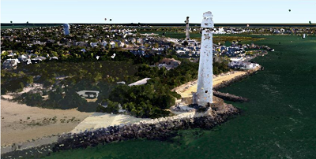
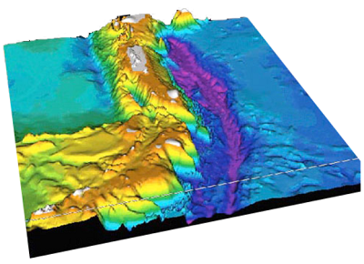

# Introduction to LiDAR

.pull-left[
- LiDAR (Light detection and ranging) is sometimes called “laser scanning” or “3D scanning”.

- LiDAR uses light in the form of a pulsed laser to measure range and distance.
  + Remote sensing method
  + Active sensor
  + Distance technology

- Consisting of a laser, a scanner, and a specialized GPS receiver.

- Airplanes and helicopters are the most commonly used platforms.

]

.pull-right[

A lidar map of Lynnhaven Inlet
Source: [NOAA](https://oceanservice.noaa.gov/facts/lidar.html)]

---

# How LiDAR works?
LiDAR is a sampling tool, which workflow can be summarized in the following five steps: 

.pull-left[1. LiDAR emits pulsed light waves into the environment.

2. Pulses bounce off and return to the LiDAR.

3. LiDAR uses time to calculate the distance.

4. Repeating this process millions of times

5. Creating a real-time 3D map of the environment.]

.pull-right[

Source: [Labroots](https://www.labroots.com/trending/technology/22851/lidar-archaeologists-forests-ancient-ruins)
]

---
# LiDAR Data

#### File Formats

- LiDAR data are available as discrete points.

- .las is the commonly used file format to store LIDAR data.

#### Data Attributes

- **x, y, z coordinates**: location information

- **Intensity**: return strength of the laser pulse

- **Point classification**: type of object (e.g ground/non-ground)

- **RGB**: RGB (red, green, and blue) bands

- **GPS time**: time stamp at which the laser point was emitted from aircraft

- **Other attributes**: Scan angle, Scan direction, Scan direction...

---
# The Application Of LiDAR

The high precision of LiDAR makes it widely used in industries and research: 

.pull-left[
- Autonomous Vehicles

- Aerial Inspection

- Precision Agriculture

- Forestry and Land management

- Survey and mapping

- Renewable Energy

- Forecast Disaster
  
- Robotics

- Atmospheric Studies

- Augmented reality]

.pull-right[

LiDAR application in AR

LiDAR application in underwater bathymetry

.footnote[Source:[GISGeography](https://gisgeography.com/lidar-uses-applications/#summary-lidar-uses-and-applications)]
]

